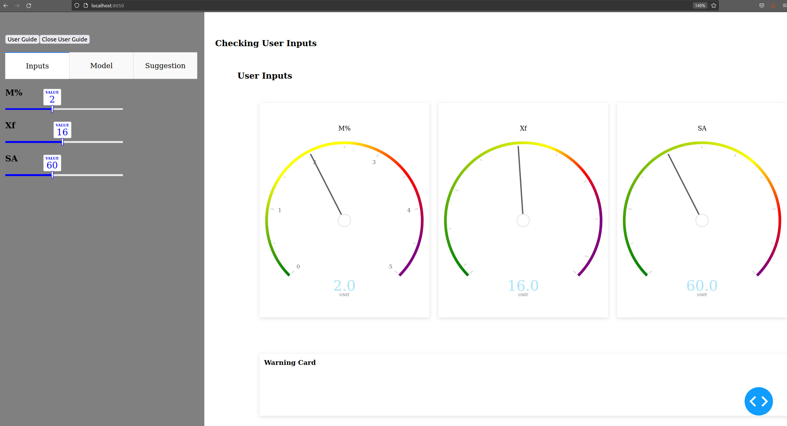
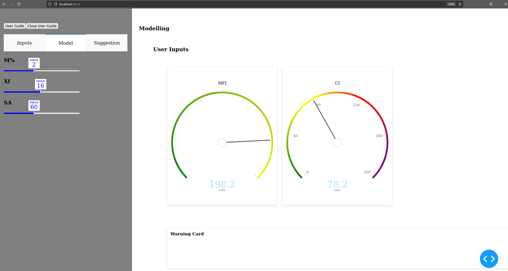
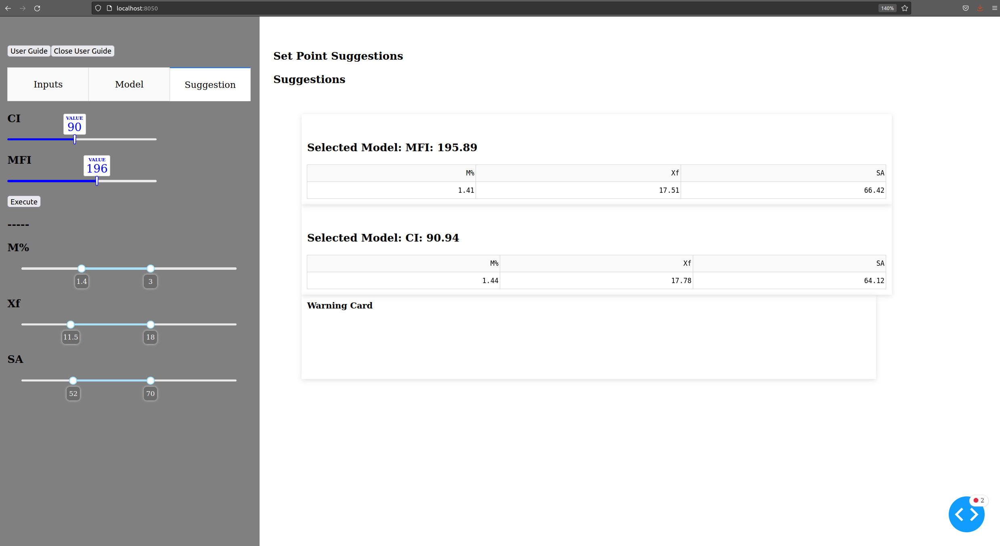

# Dashapp with models from MLflow


```bash

python3 -m venv .venv

# switch manually to virtual environment and then

$(.venv) python3 -m pip install --upgrade pip

$(.venv) pip install poetry

$(.venv) poetry install 
# will install all dependencies from the pyproject.toml file

```


We need to configure and save a `.env` file in the root folder of this Repo:

```bash

CONTAINER_NAME = "model-container"
AZURE_STORAGE_CONNECTION_STRING="DefaultEndpointsProtocol=http;AccountName=devstoreaccount1;AccountKey=Eby8vdM02xNOcqFlqUwJPLlmEtlCDXJ1OUzFT50uSRZ6IFsuFq2UVErCz4I6tq/K1SZFPTOtr/KBHBeksoGMGw==;BlobEndpoint=http://localhost:10000/devstoreaccount1;QueueEndpoint=http://localhost:10001/devstoreaccount1"

MLFLOW_TRACKING_URI="http://localhost:5000"

MLFLOW_MODEL_DIRECTORY = "models:"
MLFLOW_MODEL_STAGE = "Staging"

```

because we have already some models in our local mlflow environment and we want to download them into our local folder.


## How to work with it.

Initially create the virtual environment

Create the .env file

Dump the models out of mlflow into the model folder in the dashapp folder, check the yaml file for the correct path.

play around and start the app while executing the index.py

The app is available at `localhost:8050` in your browser


## App Design

The app consists of several parts:
- app utility functions
- basic app
- embeded app
- userguide.md
- index file


You can start the app with executing the `index.py` file. 
This will open the embeded app file, that construct the sidebar and the main body of the app out of the app.py file.
The general and hidden functions are in the utility file and the app file just loads these basic functions and executes them.


There is also a folder called `dump_models`. In there is  python file and a yaml file that needs to get configured to download the model artifacts of a specified model tracked in `mlflow` and get stored in a blobstorage to the local folder specified in the yaml file.

## App
The App is basicly an interaction with the model. The inputs get displayed, we can make predictions based on the inputs and we get a set point suggestion based on models and suggested limits of our working area. The set points are calculated with a generic optimizer and get startet when the *execution* button gets triggered.
Moreover we get a warning if we are outside of the training area. 








## User Guide 

The User Guide Button will open a modal. Not fully implemented. need some more work ;)


